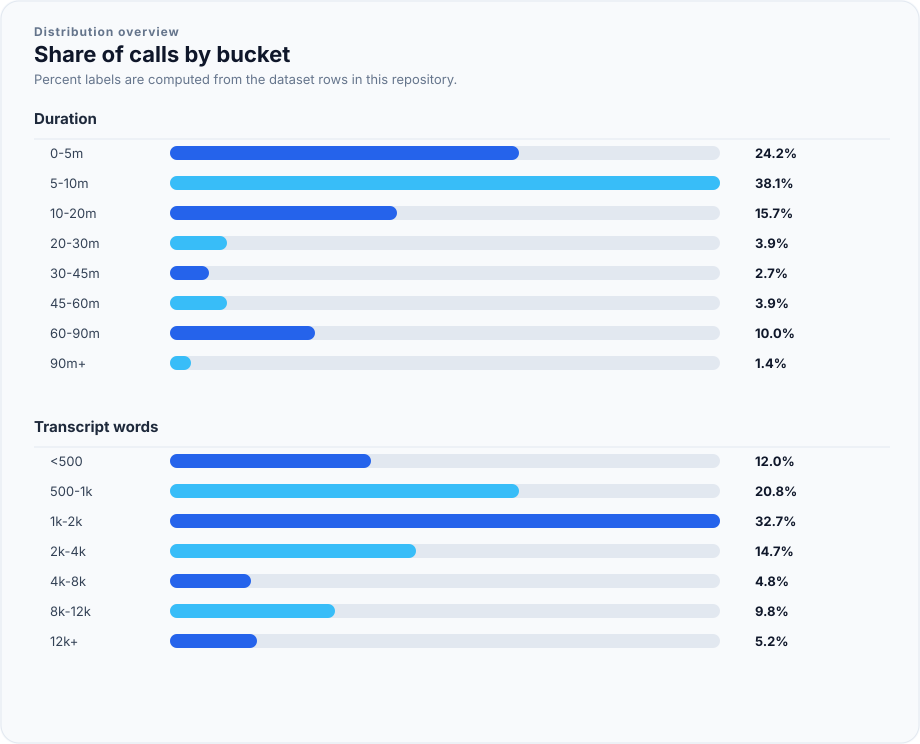

# Sumo Datasets

This repository contains selected Sumo AI dataset releases in a plain Git
repository backed by Git LFS.

Each dataset folder includes a dataset card as `README.md`, alongside the
related plot assets used by that card.

## Datasets

| Dataset | Release commit | Rows | Dataset card |
| --- | --- | ---: | --- |
| `sumo-torii/legal-services-call-audio-redacted-org1` | `9f1d070f4c32c42bade566bffe4e168679886007` | 559 | [`datasets/legal-services-call-audio-redacted-org1/README.md`](datasets/legal-services-call-audio-redacted-org1/README.md) |

## Deprecated Datasets

| Dataset | Status |
| --- | --- |
| `sumo-torii/legal-services-call-audio-redacted-org2` | Deprecated. Dataset files are not distributed from this repository. |

## Content Distribution

### Org 1



## Repository Layout

```text
datasets/
  legal-services-call-audio-redacted-org1/
    README.md
    LICENSE
    assets/content_distribution.svg
    data/train.parquet
    shards/train-00000.tar
    ...
```

Large binary dataset files are tracked with Git LFS. Run `git lfs pull` after
cloning if the working tree contains LFS pointer files instead of full files.

## License And Access

These datasets are proprietary and subject to the Sumo AI Commercial Dataset
License in [`LICENSE`](LICENSE). Access and use are limited to authorized users,
approved customers, and approved organizations under the applicable agreement.
